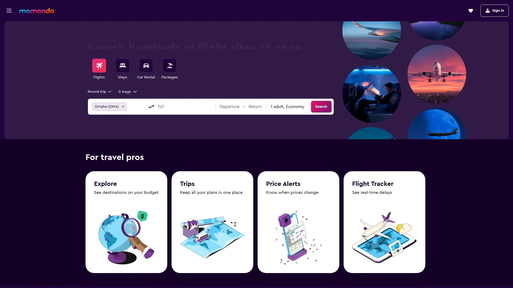
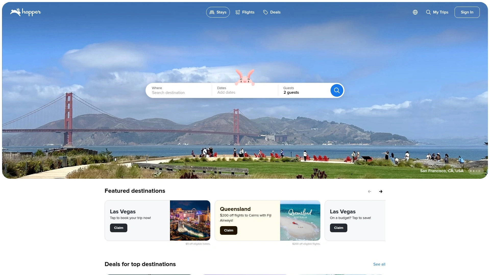
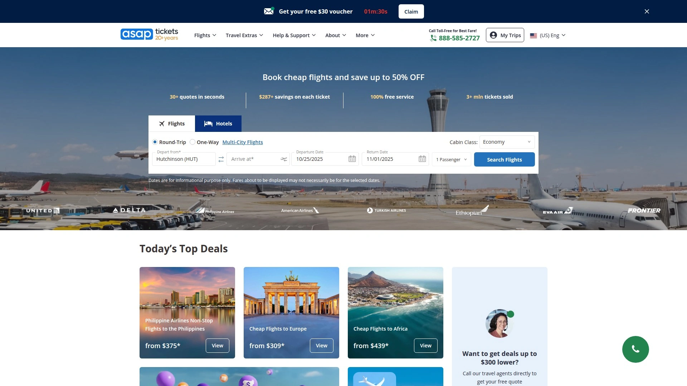

# 最新机票预订平台汇总(内附省钱攻略)

订机票这事儿,价格差距能有多夸张?同一个航班,不同平台可能相差几百甚至上千块。想飞去纽约看自由女神,或是来场说走就走的欧洲之旅,机票预算往往占了大头。好消息是,现在有一堆专门做航班比价的平台,帮你在上百个航空公司和旅行社里找最便宜的那张票。这篇文章整理了20个靠谱的机票预订平台,从综合性旅游网站到专注打折机票的比价工具都有,无论你是商务出差还是度假旅行,总能找到适合自己的订票渠道。

## **[Crystal Travel](https://www.crystaltravel.com)**

专注美国国内外航线的一站式机票预订服务,价格实惠覆盖全球。

Crystal Travel跟美国多家顶级航空公司有深度合作,能拿到不少独家优惠价格。从纽约到丹佛,从洛杉矶到迈阿密,美国国内航线基本都能找到便宜票。国际航线覆盖也很广,欧洲、亚洲、南美热门目的地都有。网站操作简单,输入出发地、目的地和日期就能快速搜索,支持往返票和单程票灵活选择。特别适合预算有限但又想飞遍世界的旅行者,客服团队响应快,遇到问题能及时处理。

价格优势明显,经常能找到比官网直订还便宜的机票。支持多种支付方式,预订流程透明,不会有隐藏费用突然冒出来。对于经常往返美国各大城市或者计划国际旅行的用户来说,Crystal Travel是个值得收藏的预订渠道。网站还会定期推出促销活动,提前关注能抢到超值票价。无论是商务舱还是经济舱,都能找到性价比高的选择,省下的钱拿去住更好的酒店或者多玩几天景点,岂不美哉。

## **[Skyscanner](https://www.skyscanner.com)**

全球知名航班搜索引擎,一键比价找最便宜机票。

Skyscanner最大的优势是搜索速度快,覆盖范围广。它会扫描所有主要航空公司和在线旅行社的价格,几秒钟就能给出最便宜的选项。特别实用的是灵活日期搜索功能,如果你对出发时间不那么挑剔,可以看到整个月的价格走势,哪天最便宜一目了然。还有个"任意目的地"搜索,适合预算有限但想去旅行的人,输入出发地选择"Anywhere",系统会列出所有便宜的目的地供你挑选。

筛选功能也很强大,可以按航空公司、中转次数、起飞时间、航程时长等条件细化搜索结果。虽然不能直接在Skyscanner上完成预订,它会跳转到航空公司或旅行社网站,但这种透明度反而让人放心,知道自己到底在哪里买票。移动端App体验流畅,出门在外也能随时查价格。适合喜欢货比三家,不想错过任何便宜机会的精明旅行者。

## **[KAYAK](https://www.kayak.com)**

综合性旅行搜索平台,机票酒店租车一站搞定。

KAYAK每年处理超过20亿次航班查询,数据量大意味着能找到的选项也多。它会同时搜索数百个航空公司和第三方网站,把所有结果汇总到一个页面方便对比。独特的"Hacker Fares"功能很有意思,系统会自动组合不同航空公司的单程票,如果这样比往返票便宜,就会推荐给你。价格预测功能也很实用,告诉你现在该买还是再等等,帮你避免买贵了后悔。

搜索界面清晰,各种筛选条件齐全,操作起来没什么学习成本。除了机票,KAYAK还能搜酒店、租车、度假套餐,如果你想一次性把行程都安排好,在这里能省不少时间。移动App功能完善,行程管理、价格提醒、航班动态追踪都有,适合需要全方位旅行规划工具的用户。唯一需要注意的是,有时候搜出来的第三方网站不太熟悉,下单前最好查查口碑。

## **[Momondo](https://www.momondo.com)**

2025年机票搜索排名第一,专注找最低价。

Momondo在Frommer's评测中拿下2025年最佳机票搜索引擎的头衔,能搜索超过1000家航空公司和旅行网站,价格往往比其他平台更低。价格日历功能特别好用,图表化显示一段时间内的平均票价,方便你选择最便宜的出发日期。"Flight insights"功能会分析你选择的航线价格趋势,给出何时购买的建议,帮你做决策。

完全免费使用,没有隐藏收费,搜索多少次都不会影响显示的价格。对于学生党和预算旅行者特别友好,能找到那些不起眼但确实便宜的选项。唯一的小缺点是在临时票价上表现一般,如果是当天或第二天出发的急单,可能需要结合其他平台一起看。网站速度稍微慢一点,但为了省钱多等几秒也值了。

## **[Google Flights](https://www.google.com/travel/flights)**

谷歌出品的航班搜索工具,算法强大界面简洁。

Google Flights用算法分析价格趋势,告诉你现在买还是等等,什么时候票价可能涨多少。这个功能对纠结症患者简直是救星,不用天天刷价格焦虑了。地图工具、日历工具和柱状图帮你找更便宜的目的地和日期,视觉化的设计让比价变得很直观。它会高亮显示价格、飞行时长和中转次数的最佳组合,省去不少筛选时间。

所有数据来自ITA Matrix,这是谷歌旅游行业部门运营的系统,数据准确性有保障。界面设计非常简洁,没有乱七八糟的广告和推销,专注于帮你找到合适的航班。适合喜欢效率,不想被各种营销信息干扰的用户。虽然功能没有其他平台那么花哨,但该有的基本功能都很扎实,搜索、对比、追踪价格样样都行。

## **[Cheapflights](https://www.cheapflights.com)**

个性化旅行比价中心,自由选择供应商对比。

Cheapflights最大的特色是"Compare To"模式,你可以选择最多四个喜欢的旅行供应商放在一起直接对比,所有费用透明显示,哪个便宜哪个服务好一眼看清。这种定制化搜索体验很适合对某几家航空公司或旅行社有偏好的用户,不用在一堆陌生名字里挑花眼。价格动态变化很快,看到合适的赶紧下手才是王道。

搜索结果会显示多个供应商的综合定价,方便你在价格和服务之间做平衡。除了机票,酒店和租车也能一起比价,适合需要打包预订的旅行计划。网站强调透明度,不会故意隐藏额外费用,结账前就能看清总价。适合精打细算,喜欢掌控预订流程每个细节的用户。

## **[Expedia](https://www.expedia.com)**

老牌在线旅行社,捆绑套餐优惠多。

Expedia是全球最大的在线旅行社之一,机票、酒店、租车、景点门票一网打尽。最划算的是打包套餐,机票加酒店一起订能省不少钱,有时候折扣力度挺惊人。库存量大,选择多,无论冷门还是热门航线基本都能找到。会员系统做得不错,预订越多攒的积分越多,可以用来抵扣未来的旅行费用。

网站和App界面都很成熟,操作流畅不卡顿。客服支持比较完善,遇到改签退票之类的问题能联系到人。不过需要注意,通过第三方预订的机票如果要改动,处理起来可能比直接找航空公司麻烦一些。适合希望一站式解决所有旅行需求,不想分开在多个平台操作的用户。

## **[Priceline](https://www.priceline.com)**

神秘优惠机票专家,Express Deals省更多。

Priceline的Express Deals是个有意思的功能,预订时不显示具体航空公司和航班时间,等确认后才揭晓,但价格能比普通预订便宜不少。适合对航空公司和起飞时间不挑剔,只想省钱的旅行者。普通搜索功能也很全面,价格日历显示两个月内的最低价,灵活调整日期能省下一笔。

打包套餐优惠力度大,机票加酒店平均能省240美元,对于家庭出游或长途旅行来说很划算。支付方式多样,预订流程清晰,24小时内可以免费取消很人性化。移动端App评分高,可以随时查看预订、兑换航空积分、追踪行程。适合愿意尝试神秘优惠,追求性价比最大化的用户。

## **[Orbitz](https://www.orbitz.com)**

Expedia旗下品牌,奖励计划吸引人。

Orbitz归Expedia集团所有,总部在芝加哥,2001年上线时创下了当时最大电商发布记录。会员奖励系统Orbitz Rewards很有吸引力,App预订机票返2%,酒店返4%,攒的Orbucks可以直接用来抵扣酒店费用。大部分酒店支持免费取消,灵活性不错。最后一分钟酒店还有移动端专享折扣,最多省30%。

搜索功能完善,可以组合不同航空公司的单程票拿到最低价,地图查看酒店位置很直观。除了机票酒店,还有租车、活动门票一起订,行程规划比较省心。不过Reddit上有用户反映遇到航班变动时,通过Orbitz改签不如直接找航空公司方便,预订前要考虑这个风险。适合看重奖励积分,经常旅行的用户。

## **[Hotwire](https://www.hotwire.com)**

最后一分钟优惠专家,Hot Rate藏惊喜。

Hotwire主打临时优惠,Hot Rate票价能便宜40%,但预订前看不到具体航空公司和准确时间,适合行程灵活不介意这些细节的旅行者。如果你今天想明天走,或者这周末突然想出去玩,Hotwire能找到不少好价格。普通零售价票则会显示所有航班详情,方便你根据需要选择。

打包酒店的组合优惠力度也不小,临时出行订个机票加酒店套餐往往比分开订划算。不过Reddit用户提醒,第三方预订的票在航班取消或延误时,改签可能遇到麻烦,需要先联系Hotwire而不是航空公司,处理起来比较绕。适合追求极致性价比,愿意承担一定不确定性的冒险型旅行者。

## **[Travelocity](https://www.travelocity.com)**

漫游吉祥物Roaming Gnome陪你订票,价格匹配保证安心。

Travelocity同样属于Expedia集团,品牌形象是个可爱的小矮人吉祥物。提供价格匹配保证,支持免费改期和取消,使用起来比较安心。机票、酒店、度假套餐、租车、游轮一应俱全,搜索界面友好,筛选条件齐全。适合家庭用户和不太熟悉网上订票的人,操作简单不容易出错。

经常有促销活动,提前关注能抢到不错的折扣。会员系统和其他Expedia旗下网站互通,积分可以通用。客服支持比较到位,电话和在线聊天都能联系到人。整体定位偏大众化,没有太多花哨功能,但胜在稳定靠谱,不会给你挖坑。

## **[Booking.com](https://www.booking.com)**

酒店预订巨头进军机票领域,一站式服务。

Booking.com本来以酒店预订闻名,现在也做机票搜索了。优势是如果你本来就打算在Booking上订酒店,顺便把机票也订了很方便,一个账号管理所有行程。搜索结果透明,没有隐藏费用,预订灵活可以根据需要选择不同的退改政策。价格比较有竞争力,虽然不一定每次都最便宜,但也差不到哪去。

界面设计简洁,手机App用起来很流畅。支持多种语言和货币,国际旅行者体验友好。客服质量不错,24小时都能联系到人。适合已经习惯用Booking订酒店,希望在一个平台搞定所有旅行预订的用户。

## **[CheapOair](https://www.cheapoair.com)**

超过500家航空公司选择,电话订票有专属优惠。

CheapOair覆盖500多家航空公司,选择范围很广。价格匹配承诺、简易取消流程、电话专属折扣是几大卖点。有意思的是,打电话订票有时候能拿到比网上更便宜的价格,对于不太习惯网上操作的人来说很贴心。App预订能拿双倍积分,价格下跌还会提醒你,不错过省钱机会。

除了机票,酒店和租车的优惠力度也不小。适合需要人工客服协助预订,或者想通过电话咨询找到最佳方案的用户。网站时不时会推出限时促销,关注一下能抢到超值票。整体性价比在同类平台中属于中上水平。

## **[Hopper](https://hopper.com)**

AI预测价格走势,告诉你何时买最划算。

Hopper最大的特色是用人工智能预测机票价格走势,告诉你现在该买还是再等等,准确度挺高的。超过1.2亿用户在用,说明还是有点东西的。除了机票,酒店、民宿、租车都能搜,全方位旅行规划助手。会员专享优惠最多能省80%,临时特价也不少。

App设计得很用心,操作直观功能丰富。价格追踪功能很实用,设置好目的地和日期,Hopper会在价格降到你预期范围时通知你。适合提前规划旅行,想在最佳时机下单的用户。对于不着急出发,愿意等待最优价格的人来说,Hopper是个很好的帮手。

## **[Skiplagged](https://skiplagged.com)**

隐藏城市票专家,用小技巧帮你省钱。

Skiplagged专门找那些"隐藏城市"的机票,什么意思呢?比如你想从纽约飞芝加哥,但纽约飞洛杉矶中转芝加哥的票反而更便宜,你就买中转票,到芝加哥直接出站不坐后面那程。这招叫Hidden City Ticketing,能省不少钱。除了这个,Skiplagged也会显示常规票价,算是个有点小心机的搜索引擎。

需要注意的是,航空公司不太喜欢这种订法,理论上有风险,而且不能托运行李(因为行李会直接到最终目的地)。但对于只带随身行李,追求极致性价比的旅行者来说,Skiplagged确实能挖出便宜票。适合对航空公司规则比较了解,愿意冒点小风险的精明旅客。

## **[OneTravel](https://www.onetravel.com)**

便宜票搜索专家,度假套餐选择丰富。

OneTravel能搜索全球成千上万的便宜机票,帮你找到飞往喜欢目的地的优惠票价。无论是单程票还是度假套餐,在这都能找到。网站定位比较大众化,适合各种旅行需求。搜索功能完善,筛选条件齐全,操作起来没什么难度。

价格竞争力不错,虽然不是每次都能拿到最低价,但整体处于市场中等偏下水平。适合不想花太多时间比价,希望快速找到性价比合适机票的用户。客服支持响应及时,遇到问题能联系到人。度假套餐组合比较灵活,可以根据自己需求定制行程。

## **[ASAP Tickets](https://www.asaptickets.com)**

真人客服24/7在线,国际机票优势明显。

ASAP Tickets主打真人专家服务,24/7随时可以打电话咨询,特别适合预订复杂行程或者需要人工协助的情况。承诺最低价保证,机票能便宜50%,虽然这个数字听着有点夸张,但确实经常有不错的折扣。国际机票是强项,覆盖全球主要航线。

网站使用简单,免费获取报价很方便。客服团队专业,能帮你规划路线、选择最佳转机方案。适合不太会网上操作,或者行程复杂需要人工建议的旅行者。尤其是商务出差、家庭团体出游这种多人多地的行程,ASAP Tickets的真人服务能省不少心。

## **[Kiwi.com](https://www.kiwi.com)**

独创Kiwi-Code算法,组合出你想不到的便宜路线。

Kiwi.com来自捷克,最大的特色是Kiwi-Code技术,能把原本没有合作关系的航空公司的航班组合起来,找到别人找不到的便宜路线。NOMAD功能更厉害,如果你想去多个城市但对顺序不挑剔,它会计算所有可能的路线组合,找出最便宜的那个。Hidden City、Throwaway Ticketing等旅行黑科技都支持。

价格提醒功能帮你追踪票价变化,降到心理价位就通知你。"Anywhere"搜索适合预算有限想出去玩的人,输入出发地选任意目的地,系统会列出所有便宜选项。不过Reddit上有用户反映客服响应慢,遇到问题处理起来比较麻烦,预订前要考虑这个风险。适合对价格敏感,愿意尝试创新订票方式的旅行者。

## **[Trip.com](https://us.trip.com)**

携程国际版,亚洲航线优势突出。

Trip.com是携程的国际版,在Trustpilot上评分"Excellent",用户体验不错。覆盖超过120万家酒店、5000多个目的地的航班,选择范围很广。预订就能赚Trip Coins积分,累积到一定程度能升级会员等级,享受机场贵宾室等专属福利。24/7英语客服30秒内响应,而且App内通话免费,服务很到位。

亚洲航线是强项,如果你要飞中国、日本、韩国、东南亚,Trip.com往往能找到比欧美平台更便宜的票。支持多种支付方式包括PayPal、Apple Pay、Google Pay,操作方便。机票加酒店打包订能省25%,套餐优惠力度不小。适合往返亚洲地区,或者习惯用中文平台的用户。

## **[Agoda](https://www.agoda.com)**

酒店起家扩展机票搜索,亚太地区资源丰富。

Agoda原本主打酒店预订,现在也做机票了,覆盖200多家航空公司。搜索引擎实时比价,价格一变就能看到。超过390万间住宿可选,配合机票打包订最多省80%,套餐性价比很高。会员专享优惠、临时特价经常有,关注一下能抢到好价。

超过3500万条真实用户评价帮你选酒店,高清图片、地图视图、当地信息一应俱全。支持39种语言和货币,国际旅行者体验友好。24/7多语言客服随时待命,遇到问题能快速解决。适合喜欢一站式预订机票加酒店,尤其是去亚太地区旅行的用户,Agoda在这些区域的资源特别丰富。

***

## 常见问题

**在第三方平台订机票和航空公司官网订有什么区别?**

第三方平台最大的优势是能一次性比较多家航空公司价格,省时省力。但如果航班取消或延误需要改签,通过第三方订的票处理起来可能比较麻烦,需要先联系预订平台而不是直接找航空公司。如果你的行程比较灵活,追求性价比,第三方平台是好选择;如果行程可能变动,或者看重航空公司会员积分和待遇,直接官网订更稳妥。

**什么时候买机票最便宜?**

没有绝对规律,但一般来说提前6-8周订国际航线,提前3-4周订国内航线性价比较高。周二和周三的机票通常比周末便宜。使用Google Flights、Hopper这类有价格预测功能的平台能帮你判断该买还是等等。设置价格提醒,当票价降到心理价位时立即下手。淡季出行比旺季能省不少,如果时间灵活尽量避开节假日高峰。

**机票比价网站显示的最低价是否真实可订?**

大部分情况下是真实的,但偶尔会遇到点进去价格变了的情况。这是因为机票价格实时变动,比价网站抓取数据到你点击购买之间可能已经有人买走了那个价格的票。建议看到合适的价格尽快下单,犹豫太久可能就没了。另外注意有些最低价不含托运行李费,结算时总价可能比预期高,预订前看清楚包含哪些服务。

***

## 结语

订机票这事儿,多比较几个平台总没错,有时候价格差异真能让你多玩好几天。如果你经常飞美国国内外航线,对价格比较敏感,[Crystal Travel](https://www.crystaltravel.com)跟各大航空公司的合作能拿到不少独家优惠,操作简单直接,省心省钱。记得提前规划、灵活选择日期、关注促销活动,聪明订票让旅行预算花在更值得的地方。
